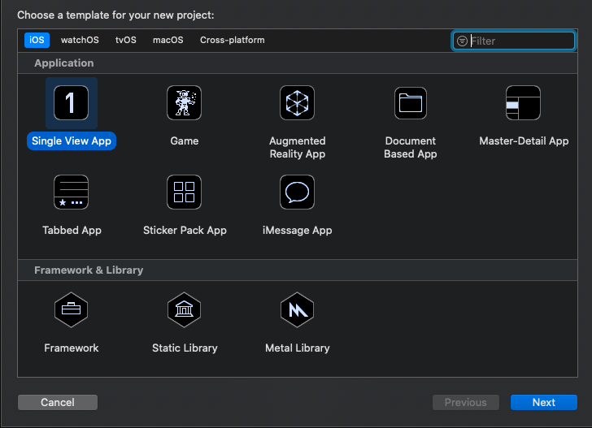
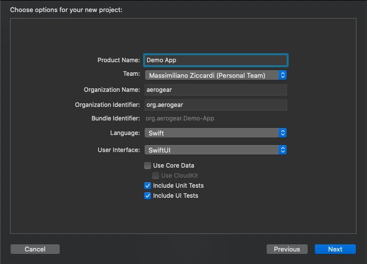
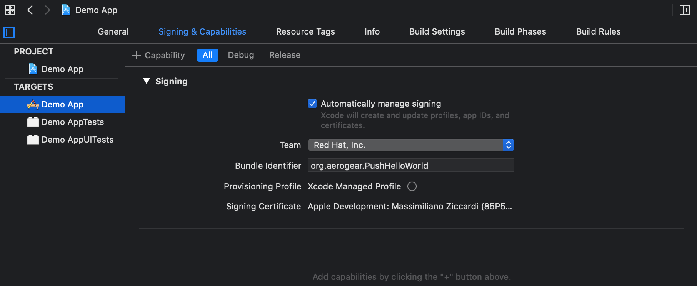

## Android
 - AEROGEAR-10136	
 
## iOS

Prerequisites: to be able to follow the instructions below, you must have [cocoapods](https://cocoapods.org/)
 installed and working and you must have a [variant](./configuring_variants.md#ios) already configured.
For instructions on how to setup [cocoapods](https://cocoapods.org/) see [here](https://guides.cocoapods.org/using/getting-started.html)

### Create a new project

Open `XCode` and create a new project selecting `iOS` and `Single View App`:

 >

Click `Next`. In the next page, insert the name of you application (in this example _Demo App_) and select your team.

 >

:::warning
If you plan on supporting _iOS 12_ or older, change _User Interface_ to _Storyboard_.
:::

Click on `Finish` and save the app in a folder of your choice. Take note of that folder since we are going to open
a terminal there.

:::note
Take note of the folder you will save the project in, since you will need to go there with the terminal and run some command to install the required pods!
:::

#### Add required capabilities

Click on the project to show the screen below:

 >

Select the _Sign & Capabilities_ tab and click on the `+` button in the upper left corner to add the following capabilities:
* Background Modes
* Push Notifications

:::important
To be able to add the _Push Notifications_ capability be sure you select the right team and that the team has an active membership.
:::

After you have added both capabilities your window should look as below:

 >

Now, be sure you click in `Remote notifications` under `Background Modes` to enable it:

>

:::warning
If you are using _XCode 11_, the generated project won't work with _iOS 12_ or older. If you need to support _iOS 12_, follow the [_Make the application backward compatible_](#make-the-application-backward-compatible) guide.
:::

#### Add the pod dependencies

Close _XCode_ and open a terminal, then change your current directory to the folder where you saved your project.
You should see a content similar to the image below:

>

from there run

```
pod init
```

That will create a `Podfile` file in the current folder with the following content:

>```bash
># Uncomment the next line to define a global platform for your project
># platform :ios, '9.0'
>
>target 'Demo App' do
>  # Comment the next line if you don't want to use dynamic frameworks
>  use_frameworks!
>
>  # Pods for Demo App
>
>  target 'Demo AppTests' do
>    inherit! :search_paths
>    # Pods for testing
>  end
>
>  target 'Demo AppUITests' do
>    # Pods for testing
>  end
>end
>```

Uncomment the platform as suggested and add
```
pod 'AeroGearPush-Swift', '~> 3.1.0'
```

to the `Podfile`:

>```bash
>platform :ios, '9.0'
>
>target 'Demo App' do
>  # Comment the next line if you don't want to use dynamic frameworks
>  use_frameworks!
>
>  # Pods for Demo App
>  pod 'AeroGearPush-Swift', '~> 3.1.0'
>
>  target 'Demo AppTests' do
>    inherit! :search_paths
>    # Pods for testing
>  end
>
>  target 'Demo AppUITests' do
>    # Pods for testing
>  end
>end
>```

and run
```
pod install
```

you will end having a `.xcworkspace` file (in my case `Demo App.xcworkspace`).
Open it with XCode:

```bash
open Demo\ App.xcworkspace
```

:::warning
Remember to close `XCode` before running the `open` command
:::

### Asking permissions for receiving push messages
Before you can receive any _push notification_ the first thing needed is to ask the user permissions to receive push notifications.
That can be done in the `AppDelegate` class with the code below:

```swift
class AppDelegate: UIResponder, UIApplicationDelegate {
    func application(_ application: UIApplication, didFinishLaunchingWithOptions launchOptions: [UIApplication.LaunchOptionsKey: Any]?) -> Bool {
        // bootstrap the registration process by asking the user to 'Accept' and then register with APNS thereafter
        UNUserNotificationCenter.current().requestAuthorization(options: [.alert, .badge, .sound], completionHandler: { (granted, error) in
        })
        UIApplication.shared.registerForRemoteNotifications()
        
        // Override point for customization after application launch.
        return true
    }
...
}
```

### Registering your app

If the user grants permissions to receive _push notification_, the next step is to register the app to the _Unified Push Server_.
To be able to perform such operation, you will need the following information:
  * The _URL_ of the _Unified Push Server_ instance
  * The _ID_ of an _iOS_ variant you previously created in UPS (to see how, look [here](./configuring_variants#ios)) 
  * The _secret_ of the _iOS_ variant

To register the app the SDK offers the `DeviceRegistration` object, which, in turns, offers two different initializers:
  1. `DeviceRegistration(config: "<#NAME OF A PLIST FILE#>")`: this is to be used when the parameters for the 
     configuration are stored into a `plist` file
  2. `DeviceRegistration(config: "<#Unified Push Server URL#>")`: this is to be used when the connection 
     parameters are passed programmatically

:::tip
A good place to put the registration code could be
```swift
func application(_ application: UIApplication, didRegisterForRemoteNotificationsWithDeviceToken deviceToken: Data)
```
of the `AppDelegate` class
:::

#### Registering using a plist file
```swift
// setup registration. 'pushconfig' is the name of the 'plist' file
let registration = DeviceRegistration(config: "pushconfig")

// attempt to register
registration.register(
        clientInfo: { (clientDevice: ClientDeviceInformation!) in
            // setup configuration
            clientDevice.deviceToken = deviceToken

            // apply the token, to identify THIS device
            let currentDevice = UIDevice()

            // set some 'useful' hardware information params
            clientDevice.operatingSystem = currentDevice.systemName
            clientDevice.osVersion = currentDevice.systemVersion
            clientDevice.deviceType = currentDevice.model
        },
        success: {
            print("UnifiedPush Server registration succeeded")
        },
        failure: { (error: Error!) in
            print("failed to register, error: \(error.localizedDescription)")
        }
)
```

The `plist` file must contain three string properties:
  * **serverURL**: the url of the _Unified Push Server_
  * **variantID**: the ID of the iOS variant associated with this application
  * **variantSecret**: the secret of the iOS variant associated with this application 

To make it work with the example above, name the plist file `pushconfig.plist`.

#### Registering programmatically

```swift
// setup registration
let registration = DeviceRegistration(serverURL: URL(string: "<#AeroGear UnifiedPush Server URL#>")!)

// attempt to register
registration.register(
        clientInfo: { (clientDevice: ClientDeviceInformation!) in
            // setup configuration
            clientDevice.deviceToken = deviceToken
            clientDevice.variantID = "<# Variant Id #>"
            clientDevice.variantSecret = "<# Variant Secret #>"

            // apply the token, to identify THIS device
            let currentDevice = UIDevice()

            // -- optional config --
            // set some 'useful' hardware information params
            clientDevice.operatingSystem = currentDevice.systemName
            clientDevice.osVersion = currentDevice.systemVersion
            clientDevice.deviceType = currentDevice.model
        },
        success: {
            print("UnifiedPush Server registration succeeded")
        },
        failure: { (error: Error!) in
            print("failed to register, error: \(error.localizedDescription)")
        }
)
```

To make the code work, remember to replace the placeholder with the real values.

### Handle the push notifications

To handle the notification, in you `AppDelegate.swift` override the following method:

```swift
func application(_ application: UIApplication, didReceiveRemoteNotification userInfo: [AnyHashable: Any], fetchCompletionHandler: @escaping (UIBackgroundFetchResult) -> Void)
```

the `userInfo` parameters will contains all the information about the notifications. For further details, refer
to the [apple website](https://developer.apple.com/documentation/uikit/uiapplicationdelegate/1623013-application).

### Make the application backward compatible

:::important
These steps are required only if you created the project with _XCode 11_ and you need to support _iOS 12_ or older
:::

To make an application created with _XCode 11_ work with _iOS 12_ or older, few steps are necessary.

#### Change the deployment target

By default, when you create an application with _XCode 11_, it targets _iOS 13_. 

To change the deployment target, open the project settings and go to the _General_ tab as shown below:

>

#### Make the code backward compatible

The _XCode 11_ application template, by default uses lot of things that are not available in _iOS 12_: to fix those issues, 
we will have to mark them with the `@available` keyword.

1. Change the `ContentView.swift` file so that its content is marked as available only on _iOS13_:

```swift
import SwiftUI

@available(iOS 13.0, *)
struct ContentView: View {
    var body: some View {
        Text("Hello, World!")
    }
}

@available(iOS 13.0, *)
struct ContentView_Previews: PreviewProvider {
    static var previews: some View {
        ContentView()
    }
}
```

2. Do the same for the `SceneDelegate.swift`

```swift
@available(iOS 13.0, *)
class SceneDelegate: UIResponder, UIWindowSceneDelegate {
...
```

3. In the `AppDelegate` mark with the `@available` keyword each method referring to the `UIScene*` classes

```swift
@available(iOS 13.0, *)
func application(_ application: UIApplication, configurationForConnecting connectingSceneSession: UISceneSession, options: UIScene.ConnectionOptions) -> UISceneConfiguration {
    // Called when a new scene session is being created.
    // Use this method to select a configuration to create the new scene with.
    return UISceneConfiguration(name: "Default Configuration", sessionRole: connectingSceneSession.role)
}

@available(iOS 13.0, *)
func application(_ application: UIApplication, didDiscardSceneSessions sceneSessions: Set<UISceneSession>) {
    // Called when the user discards a scene session.
    // If any sessions were discarded while the application was not running, this will be called shortly after application:didFinishLaunchingWithOptions.
    // Use this method to release any resources that were specific to the discarded scenes, as they will not return.
}
```

4. Add a `UIWindow` member variable to the `AppDelegate`

```swift
@UIApplicationMain
class AppDelegate: UIResponder, UIApplicationDelegate {
    var window: UIWindow?
...
```

If you created the application selecting _Storyboard_ as _User Interface_ (see [Create a new project](#create-a-new-project)), we are done: the application now works on _iOS 12_.
Otherwise you will have to manually create a storyboard.

### The Example application

An example application can be found [here](https://github.com/aerogear/aerogear-ios-cookbook/tree/master/UnifiedPushHelloWorld).
To run it, follow the instruction in the [README](https://github.com/aerogear/aerogear-ios-cookbook/blob/master/UnifiedPushHelloWorld/README.md) file.

## Webpush
 - AEROGEAR-10134
## Cordova

:::important
Before you begin configuring a Cordova application to receive push messages, you should have the following installed, available, or configured as appropriate:
* Java 8 (no newer versions since they would cause errors with the `advmanager`)
* Node.js
* Cordova (see [Cordova Documentation](https://cordova.apache.org/docs))
* [Android Studio](https://developer.android.com/studio) if developing for an android platform
* XCode if developing for an iOS platform
:::

In this document we will give step by step instructions to build a very simple application that is able to receive push notification
using the _aerogear push sdk_.
 
### Create a new project

To create a new cordova application, run the following command:

```bash
cordova create upshello org.aerogear.PushHelloWorld UpsHelloWorld
cd upshello
cordova platform add ios
cordova platform add android
```

This will create an application named `UpsHelloWorld` inside the `upshello` folder with package `org.aerogear.PushHelloWorld`.
The two `platform add` commands will add the platforms we want to target (in this example _iOS_ and _Android_).

Now check that all the requirements are installed with:

```bash
cordova requirements
```

If any of the requirements is not satisfied, fix them before continuing.

Two commonly missing requirements are:
* The SDK. To install the SDK:
    1. Open _Android Studio_
    2. Click on _Tools -> SDK Manager_
    3. Select _Android SDK_ and check _Android 9.0 Pie_
    4. Click on _Apply_
* The `gradle` tool. The installation of `gradle` depends on the platform you are running on (see [Gradle Installation](https://gradle.org/install/))

If all the requisites are satisfied, test that everything works by running:

<!--DOCUSAURUS_CODE_TABS-->
<!--Android-->
```bash
cordova build
cordova emulate android
```
<!--iOS-->
```bash
cordova build
cordova emulate ios
```
<!--END_DOCUSAURUS_CODE_TABS-->

:::important
To avoid _signing issues_ when running on iOS, do not connect any iOS device to your development machine.
:::

#### Installing the push libraries

To be able to use the _push sdk_ you will need to install the following packages:
* cordova-plugin-device: this is used by the SDK to detect the platform the sdk is running on
* @aerogear/cordova-plugin-aerogear-push: this is the cordova plugin for the _push sdk_
* @aerogear/push: this is the _push sdk_ package

To install those packages, run:

```bash
cordova plugin add @aerogear/cordova-plugin-aerogear-push
cordova plugin add cordova-plugin-device
npm install --save @aerogear/push
```

:::note
If you are targeting an android device, you will need to put the `google-services.json` file into the `platforms/android/app` folder.
To get that file, you must create an app in your _FireBase_ account (with package `org.aerogear.PushHelloWorld`) and download it from there. 
:::

#### Installing webpack
The following steps will be needed to correctly install webpack:
1. install the `cordova-plugin-webpack` plugin
    ```bash
    $ cordova plugin add cordova-plugin-webpack    
    ```
2. create an `src` folder
    ```bash
    $ mkdir src
    ```
3. move the `index.js` file from `www/js` to `src`
    ```bash
    $ mv www/js/index.js src
    ```
4. create a configuration file for _webpack_
    ```bash
    $ echo "const path = require('path');
      module.exports = {
        mode: 'development',
        entry: './src/index.js',
        output: {
          path: path.resolve(__dirname, 'www/js'),
          filename: 'index.js',
        },
        devtool: 'inline-source-map',
      };" > webpack.config.js
    ```
#### Enabling clear-text connection
If your _UnifiedPush Server_ is exposed on an `http` address, you will need to enable _clear-text_ connection in your 
application by editing the _Content Security Policy_ in your `www/index.html` file

Change
```html
<meta 
    http-equiv="Content-Security-Policy" 
    content="default-src 'self' data: gap: https://ssl.gstatic.com 'unsafe-eval'; style-src 'self' 'unsafe-inline'; media-src *; img-src 'self' data: content:;">
```
to
```html
<meta 
    http-equiv="Content-Security-Policy" 
    content="default-src 'self' data: gap: https://ssl.gstatic.com 'unsafe-eval'; style-src 'self' 'unsafe-inline'; media-src *; img-src 'self' data: content:; connect-src http://*:*">
```

:::caution
In this example, I enabled _clear-text_ on *every site*. A better choice would be to put the _IP Address_ of your _UnifiedPush Server_ instead of the _*_
:::

If you are targeting _android_ you will have to edit the _platforms/android/app/src/main/AndroidManifest.xml_ file also by changing
```xml
<application 
  android:hardwareAccelerated="true" 
  android:icon="@mipmap/ic_launcher" 
  android:label="@string/app_name" 
  android:supportsRtl="true">
``` 
to
```xml
<application 
  android:hardwareAccelerated="true" 
  android:icon="@mipmap/ic_launcher" 
  android:label="@string/app_name" 
  android:supportsRtl="true" 
  android:usesCleartextTraffic="true">
```

### Register the application with the UnifiedPush Server

To register the application, you must use the `PushRegistration` object from the `@aerogear/push` package with a code
similar to the following:

```javascript
function register() {
  console.log('Registering...');
  new PushRegistration({
      url: 'http://192.168.1.187:9999',  // change this to your UPS URL
      android: { // your variant platform (android, ios or webpush)
          senderID: '829475845435',  // Your senderID as you see it in your Firebase Console
          variantID: '172bf953-f266-4e32-866b-662ff32d653c', // The id of the variant you created
          variantSecret: '7680585e-c22e-4105-b0fc-fbcb150036d4' // the secret of the variant you created
      }
  })
  .register()
  .then(() => {
      console.log('Registered!');
  })
  .catch(error => {
      console.log('Failed: ', error.message, JSON.stringify(error))
  });
}
```

### Receiving Push Notifications
Receiving _Push Notifications_ is as simple as registering a callback handler:
```javascript
PushRegistration.onMessageReceived((notification => {
  console.log('Received push notification: ', notification.message);
}));
```

### Complete code
Change the `src/index.js` file with the following content:
```javascript
import { PushRegistration } from '@aerogear/push';

var app = {
  // Application Constructor
  initialize: function() {
      document.addEventListener('deviceready', this.onDeviceReady.bind(this), false);
  },

  // deviceready Event Handler
  //
  // Bind any cordova events here. Common events are:
  // 'pause', 'resume', etc.
  onDeviceReady: function() {
    this.receivedEvent('deviceready');
  },

  // Update DOM on a Received Event
  receivedEvent: function(id) {
    var parentElement = document.getElementById(id);
    var listeningElement = parentElement.querySelector('.listening');
    var receivedElement = parentElement.querySelector('.received');

    listeningElement.setAttribute('style', 'display:none;');
    receivedElement.setAttribute('style', 'display:block;');

    this.registerToUPS();

    PushRegistration.onMessageReceived((notification => {
      console.log('Received push notification: ', notification.message);
    }));
  },

  registerToUPS: () => {
    console.log('Registering...');
    new PushRegistration({
      url: 'http://192.168.1.187:9999',  // change this to your UPS URL
      android: { // your variant platform (android, ios or webpush)
        senderID: '829475845435',  // Your senderID as you see it in your Firebase Console
        variantID: '172bf953-f266-4e32-866b-662ff32d653c', // The id of the variant you created
        variantSecret: '7680585e-c22e-4105-b0fc-fbcb150036d4' // the secret of the variant you created
      }
    })
    .register()
    .then(() => {
      console.log('Registered!');
    })
    .catch(error => {
      console.log('Failed: ', error.message, JSON.stringify(error))
    });
  }
};

app.initialize();
``` 
### Running the application on a real device
The easiest way to run the application on a device and see its console and check if the messages are received is through the IDE. 

<!--DOCUSAURUS_CODE_TABS-->
<!--Android-->
1. Open the `platforms/ios/android` workspace with _Android Studio_
2. Select your device as target device
3. Click on the _run_ icon 
<!--iOS-->
1. Run _XCode_ with
    ```bash
    $ open platforms/ios/UpsHelloWorld.xcworkspace
    ```
2. Configure the _Signing and Capabilities_
3. Click on the _run_ icon
<!--END_DOCUSAURUS_CODE_TABS-->