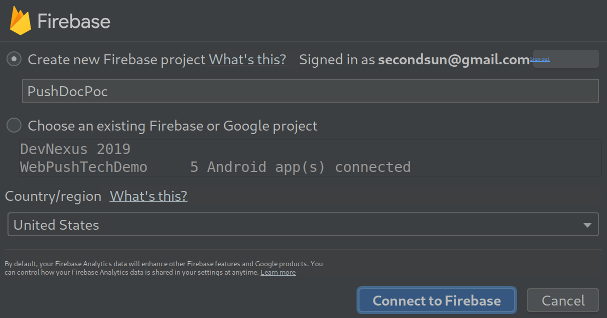
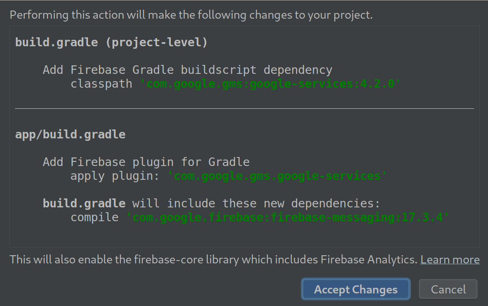
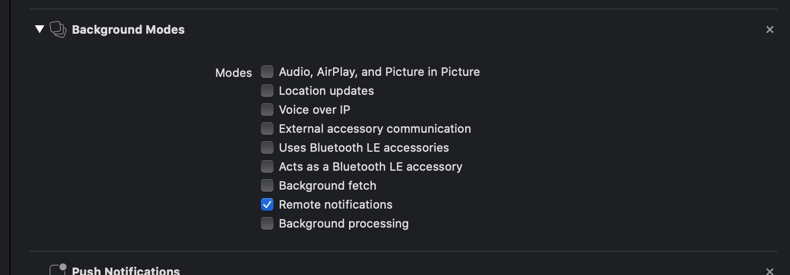
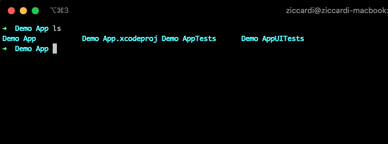
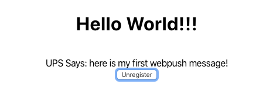

## Android
 Before you begin configuring an Android application to receive push messages, you should have the following installed, available, or configured as appropriate.

  * Android Studio
  * Google Firebase Account
  * Android Emulator or device with Google Play Services
  * Unified Push with an Android Variant Configured
 
### Overview
Unified Push makes use of Google's Firebase Cloud Messaging service (FCM).  Before you can use push messages with Android you will need to create a Firebase project.  Android Studio can guide you through this process.  Once you have your Firebase project set up, you can enable Firebase in your Android application.  Like before, Android Studio has tools to facilitate this.  These steps are covered in the section *Firebase Configuration with Android Studio*.

Once you have Firebase configured in your application, you can configure Unified Push.  This involves adding the Unified Push libraries to your Android project, and adding a configuration file to your assets folder.  With the configuration in place, you can begin using the Unified Push SDK. Configuration and usage are discussed beginning with the section *Configure the Unified Push SDK*

### Firebase Configuration with Android Studio
Android Studio can automate much of the Firebase integration process using the Firebase Assistant.

Access the assistant from the **Tools > Firebase** menu item.

>  

In the assistant select **Set up Firebase Cloud Messaging**. 

> 

Then follow the wizards launched by the *Connect to Firebase*.  The Firebase project name you choose to use should match the name of the Firebase project you used to configure your Android Variant.

> 

Finally, press the *Add FCM to your app* button and Android Studio will configure your build files so that your application can connect to Firebase.

> 


The other steps in the Firebase Assistant are handled by Unified Push and its SDKs and may be ignored.

### Configure the Unified Push SDK

The Unified Push SDK needs to be added to your project and configured.  

To add the SDK to your project, add the following to you application's build.gradle dependencies:

```gradle
    implementation 'org.jboss.aerogear:aerogear-android-push:5.1.0'
```

Now create a file `push-config.json` in `app/src/main/assets` folder.  Use the following template and copy the value from your variant in the Unified Push admin console.


```json
{
  "pushServerURL": "pushServerURL (e.g http(s)//host:port/context)",
  "android": {
    "senderID": "senderID (e.g Google Project ID only for android)",
    "variantID": "variantID (e.g. 1234456-234320)",
    "variantSecret": "variantSecret (e.g. 1234456-234320)"
  }
}
```

Ensure that you put valid values on those params, otherwise you would be unable to register and receive notifications from the UnifiedPush server. Invalid configuration params are a very common source of problems, so please revisit them if you are experiencing problems.

### Register With Unified Push

The entry point for registration is the [RegistrarManager](https://github.com/aerogear/aerogear-android-push/blob/master/library/src/main/java/org/jboss/aerogear/android/unifiedpush/RegistrarManager.java). This is a *factory* of different implementations of the [PushRegistrar](https://github.com/aerogear/aerogear-android-push/blob/master/library/src/main/java/org/jboss/aerogear/android/unifiedpush/PushRegistrar.java) interface which contain the actual registration/unregistration methods.

By default, the method will return an implementation that supports registration with the UnifiedPush server. Having the flexibility of a factory method, allows us in the future to expand it to support other different message brokers under a common messaging interface.

Since the registration setup is an one-step process not bound to any Android 'Activity', let's encapsulate it in a subclass of an Android [Application](http://developer.android.com/reference/android/app/Application.html).

Create a new class, name it `PushApplication` and paste the following code:

```java
package com.push.pushapplication;

import android.app.Application;

import org.jboss.aerogear.android.unifiedpush.PushRegistrar;
import org.jboss.aerogear.android.unifiedpush.RegistrarManager;
import org.jboss.aerogear.android.unifiedpush.fcm.AeroGearFCMPushJsonConfiguration;

public class PushApplication extends Application {

    private static final String PUSH_REGISTAR_NAME = "myPushRegistar";

    @Override
    public void onCreate() {
        super.onCreate();

        PushRegistrar pushRegistrar = RegistrarManager
                .config(PUSH_REGISTAR_NAME, AeroGearFCMPushJsonConfiguration.class)
                .loadConfigJson(getApplicationContext())
                .asRegistrar();

    }

}

```

The setup of the registration happens on the `onCreate` lifecycle method called when Android first initializes your application. It will create (and store) a [PushRegistrar](https://github.com/aerogear/aerogear-android-push/blob/master/library/src/main/java/org/jboss/aerogear/android/unifiedpush/PushRegistrar.java) object based on `push-config.json` configuration declared earlier. This object together with a name (it can be anything you choose) are passed as params on the `config` factory method to create the `PushRegistrar` object.


We are now ready to call *PushRegistrar:register* method to register our device in the UnifiedPush server. The following code goes after you assign the pushRegistrar in your Application class.

```java

    pushRegistrar.register(getApplicationContext(), new Callback<Void>() {
        @Override
        public void onSuccess(Void data) {
            Log.d(TAG, "Registration Succeeded");
            Toast.makeText(getApplicationContext(),
                    "Yay, Device registered", Toast.LENGTH_LONG).show();
        }

        @Override
        public void onFailure(Exception e) {
            Log.e(TAG, e.getMessage(), e);
            Toast.makeText(getApplicationContext(),
                    "Ops, something is wrong :(", Toast.LENGTH_LONG).show();
        }
    });

```

Don't forget to configure the Application class in `AndroidManifest.xml`
```xml
<application
    android:name=".PushApplication"
    ...
/>
```

That is all what is needed to register with the UnifiedPush server! Note that we didn't have to write any code to register the device with FCM. The library takes care off all the plumbing to register the device with FCM, obtain the `registrationId` and submit it to the UnifiedPush server.


:::note
If you don't see the _Registration Succeeded_ popup, means that an error has occurred during the registration. Switch to the LogCat console in Android Studio to locate the exception and act accordingly.
:::

### Register Message Handlers

Classes which implement the MessageHandler interface may be registered with the Unified Push SDK to handle notifications send from the Unified Push Server.  These classes may be executed on the main thread, or in background threads.  You may also provide a default handler that is executed if a message is received while your application is not running.

#### Registering and Unregistering and The Activity Lifecycle

When your Activity comes into the foreground you will want to register any MessageHandlers that need to run in the main thread.  Likewise when your Activity is in the background, you will want to have your main thread handlers disabled.  You may do this by overriding the onPause and onResume methods. 

At a minimum, your code should resemble :

```java
//messageHandler is a field that points to a messageHandler

@Override
protected void onResume() {
    super.onResume();
    RegistrarManager.registerMainThreadHandler(messageHandler); 
}

@Override
protected void onPause() {
    super.onPause();
    RegistrarManager.unregisterMainThreadHandler(messageHandler); 
}
```

If you wish, you may also have background thread handlers.

```java
RegistrarManager.unregisterBackgroundThreadHandler(messageHandler);
```

```
RegistrarManager.registerBackgroundThreadHandler(messageHandler);
```

### Hello World Example

The AeroGear project provides an example Unified Push application in their [android-cookbook repository](https://github.com/aerogear/aerogear-android-cookbook/tree/master/HelloPush)

## iOS

Prerequisites: to be able to follow the instructions below, you must have [cocoapods](https://cocoapods.org/)
 installed and working and you must have a [variant](./configuring_variants.md#ios) already configured.
For instructions on how to setup [cocoapods](https://cocoapods.org/) see [here](https://guides.cocoapods.org/using/getting-started.html)

### Create a new project

Open `XCode` and create a new project selecting `iOS` and `Single View App`:

 >

Click `Next`. In the next page, insert the name of you application (in this example _Demo App_) and select your team.

 >

:::warning
If you plan on supporting _iOS 12_ or older, change _User Interface_ to _Storyboard_.
:::

Click on `Finish` and save the app in a folder of your choice. Take note of that folder since we are going to open
a terminal there.

:::note
Take note of the folder you will save the project in, since you will need to go there with the terminal and run some command to install the required pods!
:::

#### Add required capabilities

Click on the project to show the screen below:

 >

Select the _Sign & Capabilities_ tab and click on the `+` button in the upper left corner to add the following capabilities:
* Background Modes
* Push Notifications

:::important
To be able to add the _Push Notifications_ capability be sure you select the right team and that the team has an active membership.
:::

After you have added both capabilities your window should look as below:

 >

Now, be sure you click in `Remote notifications` under `Background Modes` to enable it:

>

:::warning
If you are using _XCode 11_, the generated project won't work with _iOS 12_ or older. If you need to support _iOS 12_, follow the [_Make the application backward compatible_](#make-the-application-backward-compatible) guide.
:::

#### Add the pod dependencies

Close _XCode_ and open a terminal, then change your current directory to the folder where you saved your project.
You should see a content similar to the image below:

>

from there run

```
pod init
```

That will create a `Podfile` file in the current folder with the following content:

>```bash
># Uncomment the next line to define a global platform for your project
># platform :ios, '9.0'
>
>target 'Demo App' do
>  # Comment the next line if you don't want to use dynamic frameworks
>  use_frameworks!
>
>  # Pods for Demo App
>
>  target 'Demo AppTests' do
>    inherit! :search_paths
>    # Pods for testing
>  end
>
>  target 'Demo AppUITests' do
>    # Pods for testing
>  end
>end
>```

Uncomment the platform as suggested and add
```
pod 'AeroGearPush-Swift', '~> 3.1.0'
```

to the `Podfile`:

>```bash
>platform :ios, '9.0'
>
>target 'Demo App' do
>  # Comment the next line if you don't want to use dynamic frameworks
>  use_frameworks!
>
>  # Pods for Demo App
>  pod 'AeroGearPush-Swift', '~> 3.1.0'
>
>  target 'Demo AppTests' do
>    inherit! :search_paths
>    # Pods for testing
>  end
>
>  target 'Demo AppUITests' do
>    # Pods for testing
>  end
>end
>```

and run
```
pod install
```

you will end having a `.xcworkspace` file (in my case `Demo App.xcworkspace`).
Open it with XCode:

```bash
open Demo\ App.xcworkspace
```

:::warning
Remember to close `XCode` before running the `open` command
:::

### Asking permissions for receiving push messages
Before you can receive any _push notification_ the first thing needed is to ask the user permissions to receive push notifications.
That can be done in the `AppDelegate` class with the code below:

```swift
class AppDelegate: UIResponder, UIApplicationDelegate {
    func application(_ application: UIApplication, didFinishLaunchingWithOptions launchOptions: [UIApplication.LaunchOptionsKey: Any]?) -> Bool {
        // bootstrap the registration process by asking the user to 'Accept' and then register with APNS thereafter
        UNUserNotificationCenter.current().requestAuthorization(options: [.alert, .badge, .sound], completionHandler: { (granted, error) in
        })
        UIApplication.shared.registerForRemoteNotifications()
        
        // Override point for customization after application launch.
        return true
    }
...
}
```

### Registering your app

If the user grants permissions to receive _push notification_, the next step is to register the app to the _Unified Push Server_.
To be able to perform such operation, you will need the following information:
  * The _URL_ of the _Unified Push Server_ instance
  * The _ID_ of an _iOS_ variant you previously created in UPS (to see how, look [here](./configuring_variants#ios)) 
  * The _secret_ of the _iOS_ variant

To register the app the SDK offers the `DeviceRegistration` object, which, in turns, offers two different initializers:
  1. `DeviceRegistration(config: "<#NAME OF A PLIST FILE#>")`: this is to be used when the parameters for the 
     configuration are stored into a `plist` file
  2. `DeviceRegistration(config: "<#Unified Push Server URL#>")`: this is to be used when the connection 
     parameters are passed programmatically

:::tip
A good place to put the registration code could be
```swift
func application(_ application: UIApplication, didRegisterForRemoteNotificationsWithDeviceToken deviceToken: Data)
```
of the `AppDelegate` class
:::

#### Registering using a plist file
```swift
// setup registration. 'pushconfig' is the name of the 'plist' file
let registration = DeviceRegistration(config: "pushconfig")

// attempt to register
registration.register(
        clientInfo: { (clientDevice: ClientDeviceInformation!) in
            // setup configuration
            clientDevice.deviceToken = deviceToken

            // apply the token, to identify THIS device
            let currentDevice = UIDevice()

            // set some 'useful' hardware information params
            clientDevice.operatingSystem = currentDevice.systemName
            clientDevice.osVersion = currentDevice.systemVersion
            clientDevice.deviceType = currentDevice.model
        },
        success: {
            print("UnifiedPush Server registration succeeded")
        },
        failure: { (error: Error!) in
            print("failed to register, error: \(error.localizedDescription)")
        }
)
```

The `plist` file must contain three string properties:
  * **serverURL**: the url of the _Unified Push Server_
  * **variantID**: the ID of the iOS variant associated with this application
  * **variantSecret**: the secret of the iOS variant associated with this application 

To make it work with the example above, name the plist file `pushconfig.plist`.

#### Registering programmatically

```swift
// setup registration
let registration = DeviceRegistration(serverURL: URL(string: "<#AeroGear UnifiedPush Server URL#>")!)

// attempt to register
registration.register(
        clientInfo: { (clientDevice: ClientDeviceInformation!) in
            // setup configuration
            clientDevice.deviceToken = deviceToken
            clientDevice.variantID = "<# Variant Id #>"
            clientDevice.variantSecret = "<# Variant Secret #>"

            // apply the token, to identify THIS device
            let currentDevice = UIDevice()

            // -- optional config --
            // set some 'useful' hardware information params
            clientDevice.operatingSystem = currentDevice.systemName
            clientDevice.osVersion = currentDevice.systemVersion
            clientDevice.deviceType = currentDevice.model
        },
        success: {
            print("UnifiedPush Server registration succeeded")
        },
        failure: { (error: Error!) in
            print("failed to register, error: \(error.localizedDescription)")
        }
)
```

To make the code work, remember to replace the placeholder with the real values.

### Handle the push notifications

To handle the notification, in you `AppDelegate.swift` override the following method:

```swift
func application(_ application: UIApplication, didReceiveRemoteNotification userInfo: [AnyHashable: Any], fetchCompletionHandler: @escaping (UIBackgroundFetchResult) -> Void)
```

the `userInfo` parameters will contains all the information about the notifications. For further details, refer
to the [apple website](https://developer.apple.com/documentation/uikit/uiapplicationdelegate/1623013-application).

### Make the application backward compatible

:::important
These steps are required only if you created the project with _XCode 11_ and you need to support _iOS 12_ or older
:::

To make an application created with _XCode 11_ work with _iOS 12_ or older, few steps are necessary.

#### Change the deployment target

By default, when you create an application with _XCode 11_, it targets _iOS 13_. 

To change the deployment target, open the project settings and go to the _General_ tab as shown below:

>

#### Make the code backward compatible

The _XCode 11_ application template, by default uses lot of things that are not available in _iOS 12_: to fix those issues, 
we will have to mark them with the `@available` keyword.

1. Change the `ContentView.swift` file so that its content is marked as available only on _iOS13_:

```swift
import SwiftUI

@available(iOS 13.0, *)
struct ContentView: View {
    var body: some View {
        Text("Hello, World!")
    }
}

@available(iOS 13.0, *)
struct ContentView_Previews: PreviewProvider {
    static var previews: some View {
        ContentView()
    }
}
```

2. Do the same for the `SceneDelegate.swift`

```swift
@available(iOS 13.0, *)
class SceneDelegate: UIResponder, UIWindowSceneDelegate {
...
```

3. In the `AppDelegate` mark with the `@available` keyword each method referring to the `UIScene*` classes

```swift
@available(iOS 13.0, *)
func application(_ application: UIApplication, configurationForConnecting connectingSceneSession: UISceneSession, options: UIScene.ConnectionOptions) -> UISceneConfiguration {
    // Called when a new scene session is being created.
    // Use this method to select a configuration to create the new scene with.
    return UISceneConfiguration(name: "Default Configuration", sessionRole: connectingSceneSession.role)
}

@available(iOS 13.0, *)
func application(_ application: UIApplication, didDiscardSceneSessions sceneSessions: Set<UISceneSession>) {
    // Called when the user discards a scene session.
    // If any sessions were discarded while the application was not running, this will be called shortly after application:didFinishLaunchingWithOptions.
    // Use this method to release any resources that were specific to the discarded scenes, as they will not return.
}
```

4. Add a `UIWindow` member variable to the `AppDelegate`

```swift
@UIApplicationMain
class AppDelegate: UIResponder, UIApplicationDelegate {
    var window: UIWindow?
...
```

If you created the application selecting _Storyboard_ as _User Interface_ (see [Create a new project](#create-a-new-project)), we are done: the application now works on _iOS 12_.
Otherwise you will have to manually create a storyboard.

### The Example application

An example application can be found [here](https://github.com/aerogear/aerogear-ios-cookbook/tree/master/UnifiedPushHelloWorld).
To run it, follow the instruction in the [README](https://github.com/aerogear/aerogear-ios-cookbook/blob/master/UnifiedPushHelloWorld/README.md) file.

## Webpush

Prerequisites: to be able to follow the instructions below, you must have [Node.js](https://nodejs.org/) installed and 
working and you must have a [WebPush Variant](configuring_variants#WebPush) already configured.

The guide below will be a simple step-by-step guide to integrate a sample `React` application with _UnifiedPush Server_.

### Create a new project
This guide will walk you through the creation of a _typescrypt React_ application.
To create one, run:
```bash
$ npx create-react-app hello-world-webpush --template typescript
```

### Add the required dependencies
```bash
$ cd hello-world-webpush
$ npm install --save @aerogear/push
```

### Add the service worker

To be able to handle _push notifications_, a service worker is needed. In this guide we will provide a very simple implementation,
for instructions about writing service workers please refer to the [official documentation](https://developer.mozilla.org/en-US/docs/Web/API/Push_API). 

Inside the `public` folder, create a file named `simple-sw.js` with the following content:
```javascript
self.addEventListener('install', function(event) {
  event.waitUntil(self.skipWaiting());
});

self.addEventListener('push', event => {
  const msg_chan = new MessageChannel();
  event.waitUntil(
    self.clients.matchAll().then(clientList => {
      if (clientList.length === 0) {
        return self.registration.showNotification(data);
      } else {
        clientList.forEach(client => {
          client.postMessage(event.data.text(), [msg_chan.port2]);
        });
      }
    })
  );
});
```
:::important
By default the react template unregisters the _service worker_ automatically. That must be disabled.
:::

Edit the `src/index.tsx` file and comment the `serviceWorker.unregister();` call.

### Creating the _HelloWorld_ component

We are going to create a very simple component that will display a title ('Hello World') and the messages received by UPS.
Create a file named _HelloWorld.tsx_ in the _src_ folder:

```javascript
import React from 'react';
import { Component } from 'react';

interface HelloWorldState {
  message?: string,
  registered: boolean
}

export class HelloWorld extends Component<{}, HelloWorldState> {
  constructor() {
    super({});
    this.state = { registered: false };
  }

  private register = () => {
    // we will implement this later  
  };

  private unregister = () => {
    // we will implement this later
  };

  private handleRegistrationStatus = () => {
    if (this.state.registered) {
      this.unregister();  
    } else {
      this.register();
    }
  };

  public render = () =>{
    return (
      <>
        <h1>Hello World!!!</h1><br/>
          { this.state.message
              ? `UPS Says: ${this.state.message}`
              : 'No messages received yet' }<br/>
            <button onClick={this.handleRegistrationStatus}>{this.state.registered ? "Unregister" : "Register"}</button>
      </>
    )
  };
}
``` 
From now on, we will add here the code that integrates the _UnifiedPush Server_.

We now have the _HelloWorld_ component, but we still don't reference it anywhere. Edit the `src/App.tsx` file by removing
all the scaffolding code and add the _HelloWorld_ component to the page body. The result should be a content like the
following:

```javascript
import React from 'react';
import './App.css';

import { HelloWorld } from './HelloWorld';

const App = () => {
  return (
    <div className="App">
      <HelloWorld/>
    </div>
  );
}

export default App;
```

Now we can run the app to see that everything works as expected:
```bash
$ npm run start
```

In the browser you should see:

 >


### Add _UnifiedPush Server Integration_

#### Registration/Unregistration

The object responsible for the registration/unregistration is the `PushRegistration` class, which exposes a `register` method.
The `PushRegistration` constructor takes a configuration object as parameters with the following structure:
```javascript
const push_config = {
  url: 'your unified pushserver URL',
  webpush: {
    variantID: 'the ID of the WebPush variant you created in UPS',
    variantSecret: 'the secret of the variant identified by variantID',
    appServerKey: 'your VAPID public key (you can get it by opening the variant in UPS)'
  }
}
```
The `register` method takes one parameter also, with the following structure:
```javascript
{
    serviceWorker: 'service worker name' // in this walkthrough, simple-sw.js
}
```

Add a configuration object to the HelloWorld class in the `src/HelloWorld.tsx` file:

```javascript
private readonly push_config: PushInitConfig = {
  url: 'your unified pushserver URL',
  webpush: {
    variantID: 'the ID of the WebPush variant you created in UPS',
    variantSecret: 'the secret of the variant identified by variantID',
    appServerKey: 'your VAPID public key (you can get it by opening the variant in UPS)'
  }
};
```

Then fill the `register` and the `unregister` method:
```javascript
/**
 * Register to the UPS
 */
private register = () => {
  new PushRegistration(this.push_config)
    .register({ serviceWorker: 'simple-sw.js' })
    .then(() => this.setState({ message: "Registration successful!", registered: true }))
    .catch(error => this.setState({ message: `Registration failed - ${error}` }))
};

/**
 * Unregister from UPS
 */
private unregister = () => {
  new PushRegistration(this.push_config)
    .unregister()
    .then(() => this.setState({ message: "Unregistered successfully", registered: false }))
    .catch(error => this.setState({ message: `Operation failed - ${error}` }))
};
```

:::important
Note the parameter passed to the `register` method: the value of the _serviceWorker_ key is exactly the name of the _service worker_ file we created into the `public` folder.
:::

#### Receiving the notifications

To be able to receive notifications in your web application, you will need to register a callback that will receive
the notification object as input:

```javascript
  PushRegistration.onMessageReceived(notification => {
    const obj = JSON.parse(notification);
    this.setState({ message: obj.alert });
   });
```

#### Putting it all together

Edit the constructor of the `HelloWorld.tsx` class and add the following code:

```javascript
  PushRegistration.onMessageReceived(notification => {
    const obj = JSON.parse(notification);
    this.setState({ message: obj.alert });
   });
```

The content of the `src/HelloWorld.tsx` file should be:

```javascript
import React from 'react';
import { Component } from 'react';
import { PushInitConfig, PushRegistration } from "@aerogear/push";

interface HelloWorldState {
  message?: string,
  registered: boolean
}

export class HelloWorld extends Component<{}, HelloWorldState> {

  private readonly push_config: PushInitConfig = {
    url: 'your unified pushserver URL',
    webpush: {
      variantID: 'the ID of the WebPush variant you created in UPS',
      variantSecret: 'the secret of the variant identified by variantID',
      appServerKey: 'your VAPID public key (you can get it by opening the variant in UPS)'
    }
  };

  constructor() {
    super({});
    this.state = { registered: false };
    PushRegistration.onMessageReceived(notification => {
      const obj = JSON.parse(notification);
      this.setState({ message: obj.alert });
    });
  }

  /**
   * Register to the UPS
   */
  private register = () => {
    new PushRegistration(this.push_config)
        .register({ serviceWorker: 'simple-sw.js' })
        .then(() => this.setState({ message: "Registration successful!", registered: true }))
        .catch(error => this.setState({ message: `Registration failed - ${error}` }))
  };

  /**
   * Unregister from UPS
   */
  private unregister = () => {
    new PushRegistration(this.push_config)
        .unregister()
        .then(() => this.setState({ message: "Unregistered successfully", registered: false }))
        .catch(error => this.setState({ message: `Operation failed - ${error}` }))
  };

  private handleRegistrationStatus = () => {
    if (this.state.registered) {
      this.unregister();
    } else {
      this.register();
    }
  };

  public render = () => {
    return (
      <>
        <h1>Hello World!!!</h1><br/>
          { this.state.message
              ? `UPS Says: ${this.state.message}`
              : 'No messages received yet' }<br/>
              <button onClick={this.handleRegistrationStatus}>{this.state.registered ? "Unregister" : "Register"}</button>
      </>
    )
  };
}
```

If you didn't do already, you can now start the application with:

```bash
$ npm start
```

:::important
Remember to edit the `push_config` variable withe correct values!
:::

Click on _Register_: if everything is ok, you should see a confirmation message. 

Now try to send messages to your variant from the _UnifiedPush Server_.
You should see something like this:
 >

For a complete example, look at the [WebPush HelloWorld](https://github.com/aerogear/unifiedpush-cookbook/tree/master/webpush/hello-world-webpush) example.

## Cordova

:::important
Before you begin configuring a Cordova application to receive push messages, you should have the following installed, available, or configured as appropriate:
* Java 8 (no newer versions since they would cause errors with the `advmanager`)
* Node.js
* Cordova (see [Cordova Documentation](https://cordova.apache.org/docs))
* [Android Studio](https://developer.android.com/studio) if developing for an Android platform
* XCode if developing for an iOS platform
:::

In this document we will give step by step instructions to build a very simple application that is able to receive push notifications
using the _aerogear push sdk_.
 
:::tip Running the samples in the android emulator
This documentation will use the `cordova emulate android` command to run the samples. This command expects the emulator to be already up and running.
To start the emulator use the `emulator @AVDMNAME -no-snapshot-load` commmand, replacing *AVDNAME* with your AVD.
To have the list of AVDS use `emulator -list-avds`
The `emulator` command can be found in the `emulator` folder of the _Android SDK_.
::: 

### Create a new project

To create a new cordova application, run the following command:

```bash
cordova create upshello org.aerogear.PushHelloWorld UpsHelloWorld
cd upshello
cordova platform add ios
cordova platform add android
```

This will create an application named `UpsHelloWorld` inside the `upshello` folder with package `org.aerogear.PushHelloWorld`.
The two `platform add` commands will add the platforms we want to target (in this example _iOS_ and _Android_).

Now check that all the requirements are installed with:

```bash
cordova requirements
```

If any of the requirements is not satisfied, fix them before continuing.

Two commonly missing requirements are:
* The SDK. To install the SDK:
    1. Open _Android Studio_
    2. Click on _Tools -> SDK Manager_
    3. Select _Android SDK_ and check _Android 9.0 Pie_
    4. Click on _Apply_
* The `gradle` tool. The installation of `gradle` depends on the platform you are running on (see [Gradle Installation](https://gradle.org/install/))

If all the requisites are satisfied, test that everything works by running:

<!--DOCUSAURUS_CODE_TABS-->
<!--Android-->
```bash
cordova build
cordova emulate android
```
<!--iOS-->
```bash
cordova build
cordova emulate ios
```
<!--END_DOCUSAURUS_CODE_TABS-->

:::important
To avoid _signing issues_ when running on iOS, do not connect any iOS device to your development machine.
:::

#### Installing the push libraries

To be able to use the _push sdk_ you will need to install the following packages:
* cordova-plugin-device: this is used by the SDK to detect the platform the sdk is running on
* @aerogear/cordova-plugin-aerogear-push: this is the cordova plugin for the _push sdk_
* @aerogear/push: this is the _push sdk_ package

To install those packages, run:

```bash
cordova plugin add @aerogear/cordova-plugin-aerogear-push
cordova plugin add cordova-plugin-device
npm install --save @aerogear/push
```

:::note
If you are targeting an android device, you will need to put the `google-services.json` file into the `platforms/android/app` folder.
To get that file, you must create an app in your _FireBase_ account (with package `org.aerogear.PushHelloWorld`) and download it from there. 
:::

#### Installing webpack
The following steps will be needed to correctly install webpack:
1. install the `cordova-plugin-webpack` plugin
    ```bash
    $ cordova plugin add cordova-plugin-webpack    
    ```
2. create an `src` folder
    ```bash
    $ mkdir src
    ```
3. move the `index.js` file from `www/js` to `src`
    ```bash
    $ mv www/js/index.js src
    ```
4. create a configuration file for _webpack_
    ```bash
    $ echo "const path = require('path');
      module.exports = {
        mode: 'development',
        entry: './src/index.js',
        output: {
          path: path.resolve(__dirname, 'www/js'),
          filename: 'index.js',
        },
        devtool: 'inline-source-map',
      };" > webpack.config.js
    ```
#### Enabling clear-text connection
If your _UnifiedPush Server_ is exposed on an `http` address, you will need to enable _clear-text_ connection in your 
application by editing the _Content Security Policy_ in your `www/index.html` file

Change
```html
<meta 
    http-equiv="Content-Security-Policy" 
    content="default-src 'self' data: gap: https://ssl.gstatic.com 'unsafe-eval'; style-src 'self' 'unsafe-inline'; media-src *; img-src 'self' data: content:;">
```
to
```html
<meta 
    http-equiv="Content-Security-Policy" 
    content="default-src 'self' data: gap: https://ssl.gstatic.com 'unsafe-eval'; style-src 'self' 'unsafe-inline'; media-src *; img-src 'self' data: content:; connect-src http://*:*">
```

:::caution
In this example, we enabled _clear-text_ on *every site*. A better choice would be to put the _IP Address_ of your _UnifiedPush Server_ instead of the _*_
:::

If you are targeting _android_ you will have to add this to your `config.xml` file
```xml
<edit-config file="app/src/main/AndroidManifest.xml" mode="merge" target="/manifest/application" xmlns:android="http://schemas.android.com/apk/res/android">
  <application android:usesCleartextTraffic="true" />
</edit-config>
```

### Register the application with the UnifiedPush Server

To register the application, you must use the `PushRegistration` object from the `@aerogear/push` package with a code
similar to the following:

```javascript
function register() {
  console.log('Registering...');
  new PushRegistration({
      url: 'http://192.168.1.187:9999',  // change this to your UPS URL
      android: { // your variant platform (android, ios or webpush)
          senderID: '829475845435',  // Your senderID as you see it in your Firebase Console
          variantID: '172bf953-f266-4e32-866b-662ff32d653c', // The id of the variant you created
          variantSecret: '7680585e-c22e-4105-b0fc-fbcb150036d4' // the secret of the variant you created
      }
  })
  .register()
  .then(() => {
      console.log('Registered!');
  })
  .catch(error => {
      console.log('Failed: ', error.message, JSON.stringify(error))
  });
}
```

### Receiving Push Notifications
Receiving _Push Notifications_ is as simple as registering a callback handler:
```javascript
PushRegistration.onMessageReceived((notification => {
  console.log('Received push notification: ', notification.message);
}));
```

### Complete code
Change the `src/index.js` file with the following content:
```javascript
import { PushRegistration } from '@aerogear/push';

var app = {
  // Application Constructor
  initialize: function() {
      document.addEventListener('deviceready', this.onDeviceReady.bind(this), false);
  },

  // deviceready Event Handler
  //
  // Bind any cordova events here. Common events are:
  // 'pause', 'resume', etc.
  onDeviceReady: function() {
    this.receivedEvent('deviceready');
  },

  // Update DOM on a Received Event
  receivedEvent: function(id) {
    var parentElement = document.getElementById(id);
    var listeningElement = parentElement.querySelector('.listening');
    var receivedElement = parentElement.querySelector('.received');

    listeningElement.setAttribute('style', 'display:none;');
    receivedElement.setAttribute('style', 'display:block;');

    this.registerToUPS();

    PushRegistration.onMessageReceived((notification => {
      console.log('Received push notification: ', notification.message);
    }));
  },

  registerToUPS: () => {
    console.log('Registering...');
    new PushRegistration({
      url: 'http://192.168.1.187:9999',  // change this to your UPS URL
      android: { // your variant platform (android, ios or webpush)
        senderID: '829475845435',  // Your senderID as you see it in your Firebase Console
        variantID: '172bf953-f266-4e32-866b-662ff32d653c', // The id of the variant you created
        variantSecret: '7680585e-c22e-4105-b0fc-fbcb150036d4' // the secret of the variant you created
      }
    })
    .register()
    .then(() => {
      console.log('Registered!');
    })
    .catch(error => {
      console.log('Failed: ', error.message, JSON.stringify(error))
    });
  }
};

app.initialize();
``` 
### Running the application
The application can run in the emulator for Android, while it needs to run on a real device for iOS (the iOS simulator 
does not support _push notifications_). 

<!--DOCUSAURUS_CODE_TABS-->
<!--Android-->
1. Be sure that the emulator is already up and running
2. Issue `cordova emulate android`
<!--iOS-->
1. Connect an iOS device to the USB port of your mac
1. Run _XCode_ with
    ```bash
    $ open platforms/ios/UpsHelloWorld.xcworkspace
    ```
2. Configure the _Signing and Capabilities_
3. Click on the _run_ icon
<!--END_DOCUSAURUS_CODE_TABS-->

#### Throubleshooting
##### `cordova emulator android` takes forever to install the app into the emulator

This can happen when the `cordova emulator android` command is not able to install the app into the emulator.
To solve the issue, simply close the emulator and run it again with 
```bash
emulator @AVDNAME -no-snapshot-load
```
